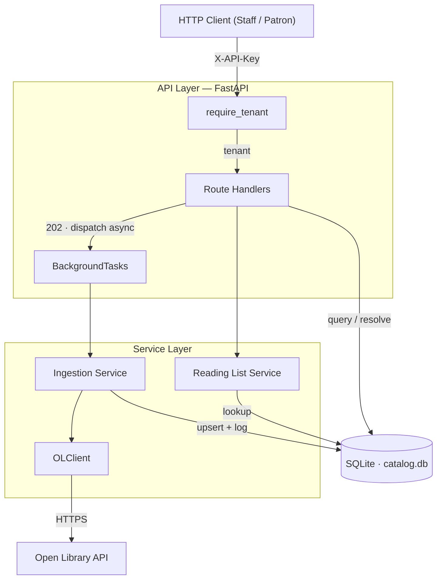

# Open Library Catalog Service

A multi-tenant catalog API that ingests book data from the [Open Library](https://openlibrary.org) public API, stores it locally in SQLite, and exposes search, browsing, and reading list endpoints per tenant.

**Docs:** [Requirements](specs/requirements.md) · [API Spec](specs/api.md) · [Data Schema](specs/schema.md) · [Architecture](architecture.md) · [ADR 001](decisions/adr_001_fastapi-and-sqlite.md)

---

## Architecture Overview



### Key Design Decisions

**FastAPI + BackgroundTasks** — Ingestion is non-blocking. `POST /ingest` returns 202 immediately; the actual OL API pagination runs in-process via `BackgroundTasks`. No broker, no worker, no Redis. See [decisions/adr_001_fastapi-and-sqlite.md](decisions/adr_001_fastapi-and-sqlite.md) for the full trade-off analysis.

**SQLite via SQLAlchemy** — Zero external dependencies. The DB file is created automatically on startup. All queries are scoped by `tenant_id` — a tenant can never access another tenant's data. See [specs/schema.md](specs/schema.md) for the full data model.

**HMAC-SHA256 for all secrets** — Tenant API keys and patron PII (name, email) are stored only as HMAC-SHA256 hashes keyed with `SECRET_KEY`. Plaintext is discarded immediately after hashing.

**OLClient rate limiting** — An `asyncio.Semaphore` caps concurrent OL requests at `OL_MAX_CONCURRENT_REQUESTS` (default 5). 429 and 5xx responses trigger exponential backoff with up to 3 retries.

---

## Setup and Run

### Prerequisites

- Docker + Docker Compose, **or** Python 3.12+ with pip

### With Docker (recommended)

```bash
# 1. Clone and enter the repo
git clone <repo-url> && cd titan

# 2. Create your .env from the example
cp .env.example .env
# Edit .env — set SECRET_KEY to a long random string

# 3. Start the service
docker compose up --build

# Service is ready when healthcheck passes:
# curl http://localhost:8000/health
```

### Without Docker (local Python)

```bash
# 1. Create and activate a virtual environment
python3 -m venv .venv
source .venv/bin/activate

# 2. Install dependencies
pip install -e .

# 3. Create your .env
cp .env.example .env
# Edit .env — set SECRET_KEY

# 4. Create the data directory
mkdir -p data

# 5. Start the server
uvicorn app.main:app --reload
```

### Environment Variables

| Variable | Required | Default | Description |
|----------|----------|---------|-------------|
| `SECRET_KEY` | Yes | — | HMAC key for hashing API keys and PII. Use a long random string |
| `DATABASE_URL` | No | `sqlite:///./data/catalog.db` | SQLAlchemy DB URL |
| `OL_BASE_URL` | No | `https://openlibrary.org` | Open Library base URL |
| `OL_MAX_CONCURRENT_REQUESTS` | No | `5` | Max concurrent OL API requests |

### Running Tests

```bash
# All unit + integration tests (no live network)
pytest tests/unit/ tests/integration/ --ignore=tests/integration/test_ol_client.py

# Including live OL API integration tests (requires internet)
pytest tests/integration/test_ol_client.py -v

# Full suite
pytest

# End-to-end tests against a running Docker service (see tests/e2e/test_docker_e2e.py)
docker compose up --build -d
pytest tests/e2e/test_docker_e2e.py -v
```

### Interactive API Docs

Once running, visit `http://localhost:8000/docs` for the auto-generated Swagger UI.

---

## API Reference

> Full endpoint documentation with request/response schemas: [specs/api.md](specs/api.md)

All tenant-facing endpoints require the `X-API-Key` header. The key is issued once when a tenant is created.

---

### Health

```bash
curl http://localhost:8000/health
# {"status":"ok"}
```

---

### Tenant Management

#### Create a tenant

```bash
curl -X POST http://localhost:8000/api/v1/admin/tenants \
  -H "Content-Type: application/json" \
  -d '{"name": "central-library"}'
```

```json
{
  "id": "a1b2c3d4-...",
  "name": "central-library",
  "api_key": "kR3mX9...",
  "created_at": "2024-01-01T10:00:00Z"
}
```

> Save the `api_key` — it is returned once and never stored in plaintext.

#### List tenants

```bash
curl http://localhost:8000/api/v1/admin/tenants
```

```json
[
  {"id": "a1b2c3d4-...", "name": "central-library", "created_at": "2024-01-01T10:00:00Z"}
]
```

---

### Ingestion

#### Trigger ingestion by author

```bash
curl -X POST http://localhost:8000/api/v1/ingest \
  -H "X-API-Key: kR3mX9..." \
  -H "Content-Type: application/json" \
  -d '{"query_type": "author", "query_value": "tolkien"}'
```

```json
{"log_id": "b2c3d4e5-...", "status": "pending"}
```

#### Trigger ingestion by subject

```bash
curl -X POST http://localhost:8000/api/v1/ingest \
  -H "X-API-Key: kR3mX9..." \
  -H "Content-Type: application/json" \
  -d '{"query_type": "subject", "query_value": "fantasy"}'
```

---

### Works

#### List works (paginated)

```bash
curl "http://localhost:8000/api/v1/works?page=1&page_size=20" \
  -H "X-API-Key: kR3mX9..."
```

#### Filter works

```bash
# By author
curl "http://localhost:8000/api/v1/works?author=tolkien" \
  -H "X-API-Key: kR3mX9..."

# By subject
curl "http://localhost:8000/api/v1/works?subject=fantasy" \
  -H "X-API-Key: kR3mX9..."

# By year range
curl "http://localhost:8000/api/v1/works?year_from=1950&year_to=1980" \
  -H "X-API-Key: kR3mX9..."

# Combined
curl "http://localhost:8000/api/v1/works?author=tolkien&year_from=1950&year_to=1970" \
  -H "X-API-Key: kR3mX9..."
```

#### Keyword search

```bash
curl "http://localhost:8000/api/v1/works/search?q=fellowship" \
  -H "X-API-Key: kR3mX9..."
```

#### Get a single work

```bash
curl "http://localhost:8000/api/v1/works/<work_id>" \
  -H "X-API-Key: kR3mX9..."
```

```json
{
  "id": "c3d4e5f6-...",
  "ol_work_key": "/works/OL27516W",
  "title": "The Fellowship of the Ring",
  "author_names": ["J.R.R. Tolkien"],
  "first_publish_year": 1954,
  "subjects": ["fantasy", "fiction"],
  "cover_image_url": "https://covers.openlibrary.org/b/id/12345-M.jpg"
}
```

---

### Ingestion Logs

#### List logs

```bash
curl "http://localhost:8000/api/v1/ingestion-logs" \
  -H "X-API-Key: kR3mX9..."
```

#### Poll a specific log (check ingestion progress)

```bash
curl "http://localhost:8000/api/v1/ingestion-logs/<log_id>" \
  -H "X-API-Key: kR3mX9..."
```

```json
{
  "id": "b2c3d4e5-...",
  "status": "completed",
  "fetched_count": 50,
  "succeeded_count": 49,
  "failed_count": 1,
  "error_details": null,
  "started_at": "2024-01-01T10:00:00Z",
  "finished_at": "2024-01-01T10:00:45Z"
}
```

---

### Reading Lists

#### Submit a reading list

```bash
curl -X POST http://localhost:8000/api/v1/reading-lists \
  -H "X-API-Key: kR3mX9..." \
  -H "Content-Type: application/json" \
  -d '{
    "patron_name": "Alice Smith",
    "patron_email": "alice@library.org",
    "books": ["/works/OL27516W", "/works/OL1234W"]
  }'
```

```json
{
  "reading_list_id": "d4e5f6g7-...",
  "resolved": ["/works/OL27516W"],
  "unresolved": ["/works/OL1234W"]
}
```

> PII is hashed before storage. Neither `patron_name` nor `patron_email` appears in the database or any response.

#### List reading lists

```bash
curl "http://localhost:8000/api/v1/reading-lists" \
  -H "X-API-Key: kR3mX9..."
```

#### Get a reading list with items

```bash
curl "http://localhost:8000/api/v1/reading-lists/<reading_list_id>" \
  -H "X-API-Key: kR3mX9..."
```

---

## End-to-End Workflow Example

```bash
API_KEY="kR3mX9..."

# 1. Ingest Tolkien's works
LOG=$(curl -s -X POST http://localhost:8000/api/v1/ingest \
  -H "X-API-Key: $API_KEY" -H "Content-Type: application/json" \
  -d '{"query_type":"author","query_value":"tolkien"}' | jq -r .log_id)

# 2. Poll until completed
curl -s "http://localhost:8000/api/v1/ingestion-logs/$LOG" \
  -H "X-API-Key: $API_KEY" | jq '{status,fetched_count,succeeded_count}'

# 3. Search the catalog
curl -s "http://localhost:8000/api/v1/works/search?q=ring" \
  -H "X-API-Key: $API_KEY" | jq '.total'

# 4. Submit a patron reading list
curl -s -X POST http://localhost:8000/api/v1/reading-lists \
  -H "X-API-Key: $API_KEY" -H "Content-Type: application/json" \
  -d '{"patron_name":"Alice","patron_email":"alice@lib.org","books":["/works/OL27516W"]}'
```

---

## What I Would Do Differently With More Time

These reflect trade-offs made deliberately given the scope — each is a known limitation, not an oversight.

### 1. Replace BackgroundTasks with a durable task queue

`FastAPI BackgroundTasks` runs in the same uvicorn worker process. If the process restarts mid-ingestion, the task is silently lost and the `IngestionLog` row is stuck in `running` forever. A production system would use Celery + Redis or a lightweight queue like `arq` to get task durability, retry-on-crash, and queue depth visibility. A startup hook that resets stale `running` logs to `failed` would be a minimum mitigation within the current design. *(See [ADR 001](decisions/adr_001_fastapi-and-sqlite.md))*

### 2. Add Alembic for schema migrations

`Base.metadata.create_all()` on startup works for a fresh database but provides no path for evolving an existing schema without data loss. Alembic with versioned migration files would be essential before any production deployment, and would also make the schema history auditable.

### 3. Protect the admin bootstrap endpoint

`POST /api/v1/admin/tenants` has no authentication — intentionally, to allow initial tenant creation. In production this endpoint should be protected by an admin secret header or restricted to internal network traffic only. It is currently a minor privilege escalation risk if the service is internet-facing.

### 4. Per-tenant rate limiting on inbound requests

The current design rate-limits *outbound* OL API calls via `asyncio.Semaphore`, but applies no limits to *inbound* API requests. A noisy tenant can trigger unlimited ingestion jobs. A simple per-tenant job concurrency check (reject if a `running` log already exists for that tenant) and request-rate middleware would address this.

### 5. Work version history (Tier 3 tasks)

[TASK-038 through 040](tasks.md) define a `WorkVersion` model and versioned upsert that records a snapshot and diff whenever re-ingestion changes a work's metadata. This is not implemented — it would significantly improve auditability for long-running catalogs where OL data drifts over time.

### 6. Scheduled catalog refresh

The requirements note the catalog should stay fresh "without requiring manual intervention." The current design requires a manual `POST /ingest` to trigger ingestion — there is no scheduled or automatic re-ingestion. A cron-based scheduler (e.g. APScheduler inside the process, or an external cron hitting the endpoint) would close this gap without additional infrastructure.

### 7. Reading list re-resolution

When a patron submits a reading list and some books are `unresolved`, there is currently no mechanism to re-run resolution after ingestion completes. A background job or webhook trigger that re-checks `unresolved` items against newly ingested works would close this gap.
