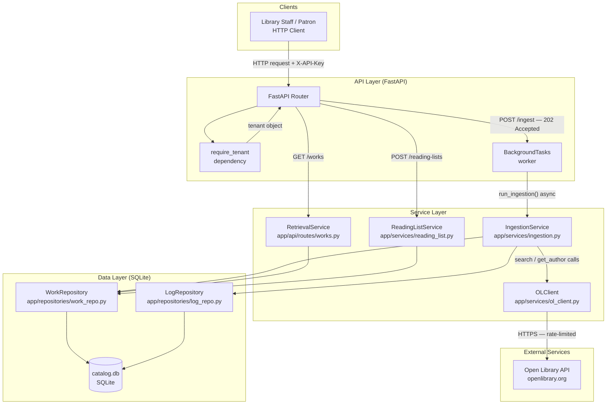
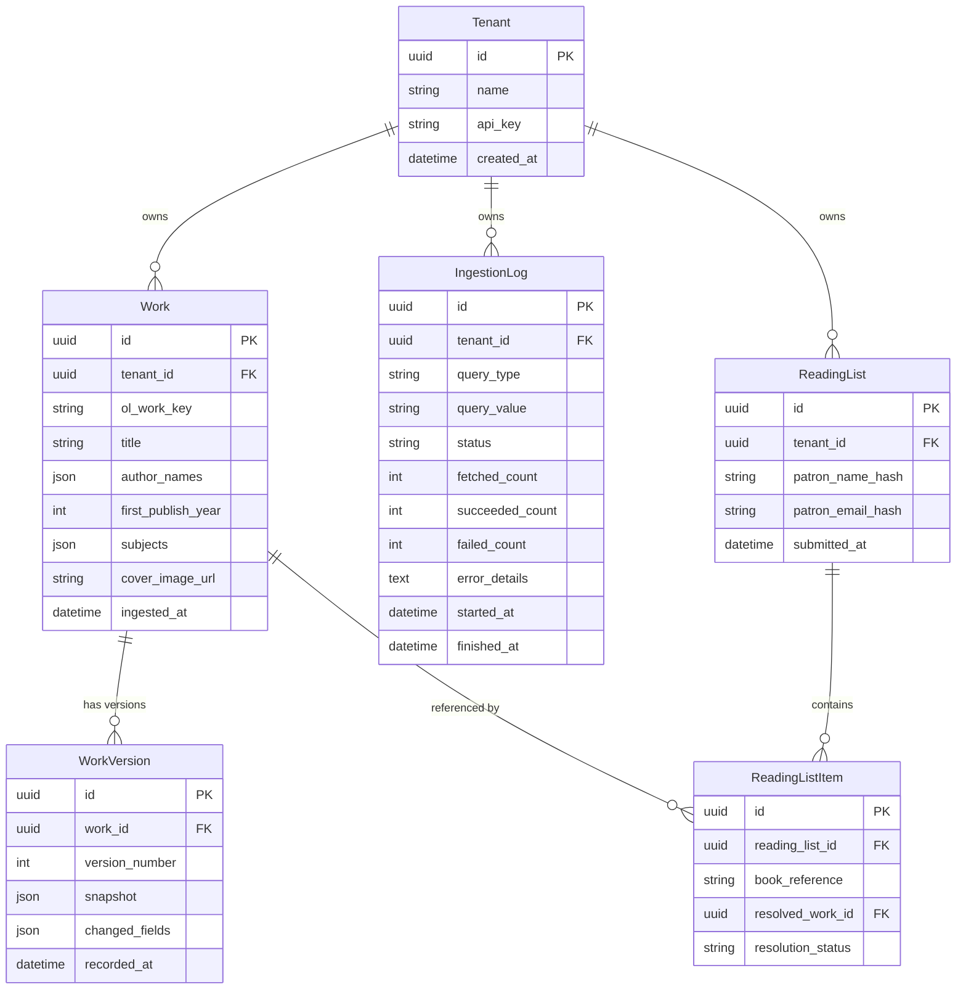

# Architecture

This document is the single source of truth for the project's design. All implementation decisions trace back to something defined here.

---

## Project Overview

**Name:** Open Library Catalog Service

**Problem:** Library consortiums operate multiple branches, each with their own catalog needs and patron base. There is no unified way to aggregate, search, and browse book data across branches while keeping each library's data isolated from others. Patron reading lists contain PII that must be handled carefully.

**Solution:** A multi-tenant Python/FastAPI service that ingests book data from the Open Library public API and stores it locally per tenant. Library staff can trigger ingestion by author or subject; patrons can search and browse the catalog, and submit personal reading lists. All data is scoped to a tenant — one library's catalog never leaks into another's responses.

**Primary Users:**
- **Library patrons** — search and browse the catalog, submit personal reading lists
- **Library staff** — trigger catalog ingestion, monitor ingestion progress and activity logs

---

## Goals

### Must Achieve
- Multi-tenant catalog ingestion from Open Library (by author or subject)
- Retrieval API with pagination, filtering (author, subject, year range), and keyword search
- Activity log for every ingestion operation, queryable via API
- Reading list submissions with PII (name, email) hashed before storage
- Non-blocking ingestion — API responses must not wait for OL API calls

### Should Achieve
- Per-tenant rate limiting to prevent noisy-neighbor resource exhaustion
- Version history for ingested works when metadata changes on re-ingestion

### Non-Goals (explicitly out of scope)
- Real-time or push-based synchronization with Open Library
- User authentication system beyond API key per tenant
- Admin UI or frontend
- Multi-region deployment or horizontal scaling in v1

---

## Architecture Principles

These principles guide every design and implementation decision.

- **Simplicity first** — prefer the simpler solution unless there's a compelling reason not to
- **Explicit over implicit** — make behavior visible and traceable
- **Spec before code** — nothing is implemented without a corresponding spec or task
- **Incremental delivery** — design for small, deployable increments
- **Tenant isolation at every query** — all database queries must filter by `tenant_id`; never fetch data without a tenant scope
- **PII hashed at the boundary** — patron name and email are hashed with `hash_pii()` before any persistence call; plaintext PII must never reach the database
- **Background work stays in-process** — use FastAPI `BackgroundTasks` for async ingestion; no external broker or worker process required

---

## Tech Stack

| Layer | Choice | Rationale |
|-------|--------|-----------|
| Language | Python 3.12 | Required by spec |
| Framework | FastAPI | Async-native, `BackgroundTasks` built-in, automatic OpenAPI docs |
| Data Store | SQLite via SQLAlchemy | Zero-dependency local persistence; `Base.metadata.create_all()` on startup |
| HTTP Client | httpx | Async-native; `MockTransport` enables unit tests without live network calls |
| Config | pydantic-settings | Type-safe environment variable loading with validation |
| Containerization | Docker Compose (single service) | Single-command startup with `make run` or `docker compose up` |
| Testing | pytest + httpx `TestClient` | In-memory SQLite test DB; isolated per test |
| Linting / Formatting | ruff + black | Fast linting and consistent formatting |

---

## Coding Standards

- **Naming:** `snake_case` for all Python identifiers. Module names are prefixed by domain: `work_repo.py`, `ol_client.py`, `log_repo.py`
- **Tenant isolation:** Every DB query must include a `tenant_id` filter. Any query missing a tenant scope is a bug
- **Error handling:** Services raise typed exceptions (`OLNotFoundError`, `OLRateLimitError`, etc.). Route handlers catch them and convert to `HTTPException`. Never raise `HTTPException` from service or repository code
- **PII:** All calls to `hash_pii()` happen in route handlers or the service layer before any repository call. Repositories only ever receive already-hashed values
- **Tests:** Unit tests mock `OLClient` using `httpx.MockTransport` — no live OL calls in unit tests. Integration tests use an in-memory SQLite DB injected via the `get_db` dependency override
- **Logging:** Log structured events at ingestion start, per-page progress, and completion/failure. Include `tenant_id`, `query_type`, `query_value`, and counts in each log entry
- **Formatting:** All files formatted with `black`; `ruff` must report no errors before committing

---

## System Design

### High-Level Component Diagram

---

### Data Flow: Catalog Ingestion

1. Staff sends `POST /api/v1/ingest` with `{"query_type": "author", "query_value": "Ursula K. Le Guin"}`
2. `require_tenant` validates `X-API-Key` and injects the `Tenant` object
3. Route handler creates an `IngestionLog` row (`status=pending`) via `LogRepository`
4. Route handler registers `run_ingestion(...)` with FastAPI `BackgroundTasks` and immediately returns `202 Accepted` with the `log_id`
5. **Background:** `run_ingestion` calls `OLClient.search_works_by_author()` — paginates until results are exhausted or 500 works reached
6. For each work: `ingest_single_work()` calls `OLClient.get_author()` for each unresolved author key, builds the cover URL, then calls `WorkRepository.upsert_work()`
7. After each page: `LogRepository.update_log()` increments `fetched_count`, `succeeded_count`, `failed_count`
8. On completion: log `status` set to `completed`; on unrecoverable error: `failed`
9. Staff polls `GET /api/v1/ingestion-logs/{log_id}` to check progress

---

### Data Flow: Reading List Submission

1. Patron sends `POST /api/v1/reading-lists` with `{"patron_name": "...", "patron_email": "...", "books": ["/works/OL123W"]}`
2. `require_tenant` validates the API key
3. Route handler calls `hash_pii(patron_name)` and `hash_pii(patron_email)` — plaintext is discarded immediately
4. If a `ReadingList` with `(tenant_id, patron_email_hash)` already exists, the existing row is updated (upsert)
5. `resolve_book_references()` looks up each book reference against locally stored `Work` rows for this tenant
6. `ReadingListItem` rows are written with `resolved` or `unresolved` status
7. Response returns `{"reading_list_id": "...", "resolved": [...], "unresolved": [...]}`

---

### Data Model Diagram

---

### Key Interfaces

| Boundary | Protocol | Auth | Notes |
|----------|----------|------|-------|
| Client ↔ API | REST / HTTP JSON | `X-API-Key` header → hashed lookup | All routes except `/health` and `/admin/tenants` require a valid tenant key |
| API ↔ OLClient | Async HTTPS (httpx) | None (public API) | `asyncio.Semaphore` limits concurrent requests; exponential backoff on 429/5xx |
| API ↔ SQLite | SQLAlchemy sync session | None (local file) | `get_db` dependency yields a session; `create_all` on startup creates all tables |

---

### Scalability and Performance Considerations

- **Single-process design:** FastAPI `BackgroundTasks` runs in the same uvicorn worker. Multiple concurrent ingestion jobs share the same process and SQLite connection pool
- **SQLite ceiling:** Appropriate for local development and small deployments. For higher concurrency or multi-process deployments, replace `DATABASE_URL` with a PostgreSQL connection string — no other code changes required
- **OL API throttling:** `OLClient` uses `asyncio.Semaphore(OL_MAX_CONCURRENT_REQUESTS)` to prevent rate-limit errors. Exponential backoff handles transient 429 responses
- **Ingestion cap:** Hard limit of 500 works per ingestion job prevents runaway jobs from monopolising the worker thread

---

### Security Considerations

- **Tenant API keys:** Generated as random secrets; stored as HMAC-SHA256 hashes. The plaintext key is returned once at creation and never stored
- **Patron PII:** `hash_pii(value, SECRET_KEY)` uses HMAC-SHA256. Same email → same hash (enabling deduplication) but is not reversible. `SECRET_KEY` must be set in the environment
- **Tenant isolation:** Every repository function accepts `tenant_id` as a required parameter and includes it in all WHERE clauses. No global query path exists that could accidentally return cross-tenant data
- **Admin bootstrap endpoint:** `POST /admin/tenants` has no auth to allow initial tenant creation. In production, restrict this endpoint by network policy or a shared admin secret

---

## Open Questions

> Move items to `decisions/` as ADRs once resolved.

- [ ] Should `POST /admin/tenants` require an admin secret before deployment to production?
- [ ] Should SQLite WAL mode be enabled to support concurrent reads during background ingestion?
- [ ] Should the 500-work ingestion cap be configurable per tenant via a settings field?
